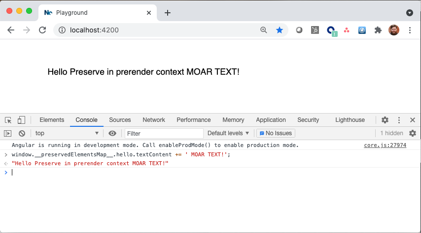

# What is this?

See the [element-preserver README](libs/README.md) to learn what this is, and try it out in your own project.

# Demo

See the demo in action:

1.  git clone, npm install, then:
2.  `npm run serve:ssr`
3.  Open http://localhost:4200
4.  Open devtools and manipulate the cached element in the private cache: `window.__preservedElementsMap__.hello.textContent += ' MOAR TEXT!';`
5.  You should see your text appear on the screen

